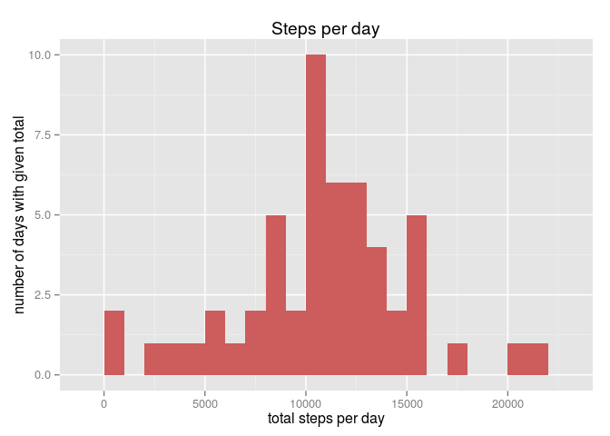
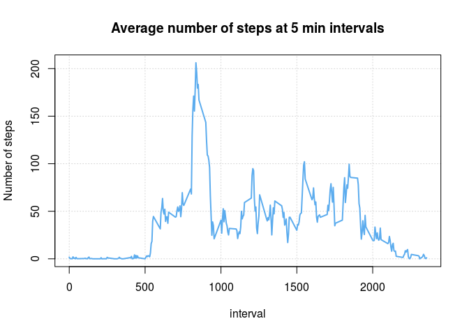
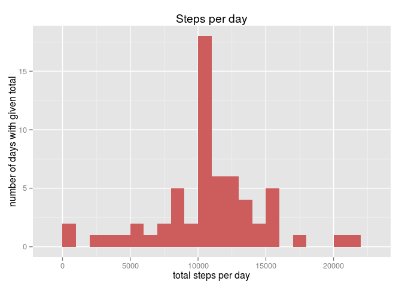
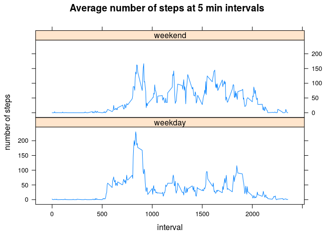

# Reproducible Research: Peer Assessment 1


## Loading and preprocessing the data

We assume that activity.csv (or activity.zip) dataset is in the current
directory:


```r
# check if activity.csv exists; if not, try unzipping activity.zip
if (!file.exists('activity.csv')) unzip('activity.zip')

# load data frame
df <- read.csv('activity.csv')

# let the class of `date` be Date
df$date <- as.Date(df$date)
```


## What is mean total number of steps taken per day?

_NOTE: We're ignoring missing values here_

### 1. Total number of steps per day


```r
# NOTE aggregate will (by default) ignore NA
total.steps <- function (df) aggregate(steps ~ date, df, sum)

total <- total.steps(df)
```

Let's have a peek at the `total` data:


```r
# NOTE: this requires install.packages('xtable')
library(xtable)
hd <- head(total)
hd$date <- as.character(hd$date)
print(xtable(hd), type="html")
```

<!-- html table generated in R 3.2.1 by xtable 1.8-0 package -->
<!-- Fri Jan  8 15:34:42 2016 -->
<table border=1>
<tr> <th>  </th> <th> date </th> <th> steps </th>  </tr>
  <tr> <td align="right"> 1 </td> <td> 2012-10-02 </td> <td align="right"> 126 </td> </tr>
  <tr> <td align="right"> 2 </td> <td> 2012-10-03 </td> <td align="right"> 11352 </td> </tr>
  <tr> <td align="right"> 3 </td> <td> 2012-10-04 </td> <td align="right"> 12116 </td> </tr>
  <tr> <td align="right"> 4 </td> <td> 2012-10-05 </td> <td align="right"> 13294 </td> </tr>
  <tr> <td align="right"> 5 </td> <td> 2012-10-06 </td> <td align="right"> 15420 </td> </tr>
  <tr> <td align="right"> 6 </td> <td> 2012-10-07 </td> <td align="right"> 11015 </td> </tr>
   </table>

### 2. Histogram of the total number of steps taken each day


```r
library(ggplot2)

make.histogram <- function (total)
    ggplot(total, aes(x=steps)) +
        geom_histogram(binwidth = 1000, fill = "indianred") +
        labs(title = "Steps per day",
             x = "total steps per day",
             y = "number of days with given total")

make.histogram(total)
```

 

### 2. Mean and median of the total number of steps taken per day

The mean of the total number of steps/day is:

```r
mean(total$steps)
```

```
[1] 10766.19
```

And the median is:

```r
median(total$steps)
```

```
[1] 10765
```

## What is the average daily activity pattern?


```r
da <- aggregate(steps ~ interval, df, mean) # again: aggregate ignores NA
with(da, plot(interval, steps, type = "l", col = "steelblue2", lwd = 2,
              main="Average number of steps at 5 min intervals",
              ylab="Number of steps",
              panel.first = grid()))
```

 

### Which 5-minute interval, on average across all the days in the dataset, contains the maximum number of steps?


```r
interval <- da$interval[which.max(da$steps)]
interval
```

```
[1] 835
```

Maximum number of steps is made in the interval starting at 835th
minute (this is at 13:55).

## Imputing missing values

Note that values are missing only in `steps` column:

```r
sapply(df, function (cl) any(is.na(cl)))
```

```
   steps     date interval 
    TRUE    FALSE    FALSE 
```

### 1. Missing values in dataset


```r
num.missing <- sum(is.na(df$steps)) # num.missing
num.missing
```

```
[1] 2304
```

There are 2304 missing values in the data set
(13.11% of total records)

### 2., 3. Filling in the missing values

Strategy: we'll fill missing `steps` with the average value for given interval.


```r
# we already have the required means computed in da (see above)
d2 <- merge(df, da, by='interval')
# now d2$steps.x contains original steps values
# and d2$steps.y contains means from da

# bring back original 'steps' name
names(d2)[names(d2) == 'steps.x'] <- 'steps'
missing <- is.na(d2$steps)
# substitute means for missing values
d2$steps[missing] <- d2$steps.y[missing]
```

### 4. Histogram, mean and median


```r
# reuse function from before
total2 <- total.steps(d2)
make.histogram(total2)
```

 


```r
mean(total2$steps)
```

```
[1] 10766.19
```

```r
median(total2$steps)
```

```
[1] 10766.19
```

Our strategy for imputing missing values did not change the mean or median.
Why is that?


```r
dm <- d2[missing,] # 'missing' part
table(dm$date)
```

```

2012-10-01 2012-10-08 2012-11-01 2012-11-04 2012-11-09 2012-11-10 
       288        288        288        288        288        288 
2012-11-14 2012-11-30 
       288        288 
```

So there are 8 days with missing `steps` and all of them have `288` missing
samples. But `length(unique(d2$interval))` is 288
meaning that *all* interval samples are missing for given days.
Therefore by substituting mean values for missing values we make all those days
look *average*.

In particular, the total number of steps made in those artificially populated
days is equal to the mean total number of steps across the whole data.
That's why:

- in the second histogram we have the bucket containing the mean higher by 8
(compared to the first one). This is the contribution of those 8
_artificial_ days
- the mean itself (of the total number of steps) did not change
- furthermore, as the date is symmetric (mean equals median), those
_artificial_ days didn't change the median either.

## Are there differences in activity patterns between weekdays and weekends?

Let's annotate the data with "weekday" or "weekend" value.

```r
wd <- weekdays(d2$date)
#weekend <- wd == 'Saturday' | wd == 'Sunday'
#wd[weekend] <- "weekend"
#wd[!weekend] <- "weekday"

#d2$day.kind <- factor(wd)
d2$day.kind <- factor(ifelse(wd == 'Saturday' | wd == 'Sunday', 'weekend', 'weekday'))
```

Plot daily activity on weekends and weekdays:


```r
wa <- aggregate(steps ~ interval * day.kind, d2, mean)

library(lattice)
xyplot(steps ~ interval | day.kind, wa, type="l", layout=c(1,2), ylab="number of steps",
       main="Average number of steps at 5 min intervals")
```

 
